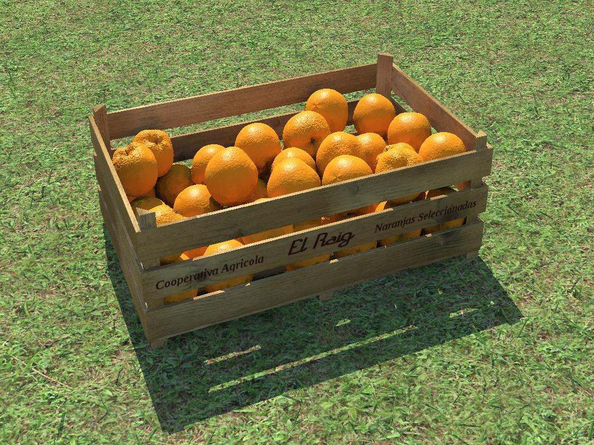
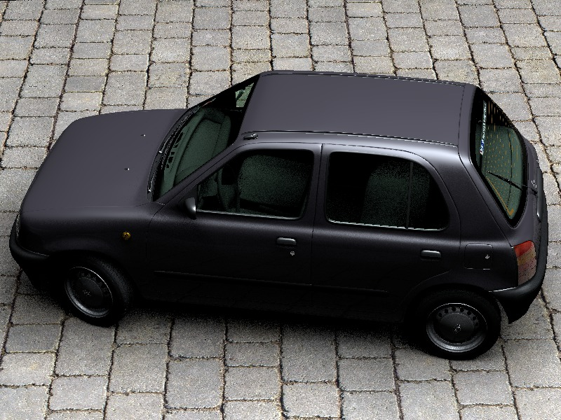
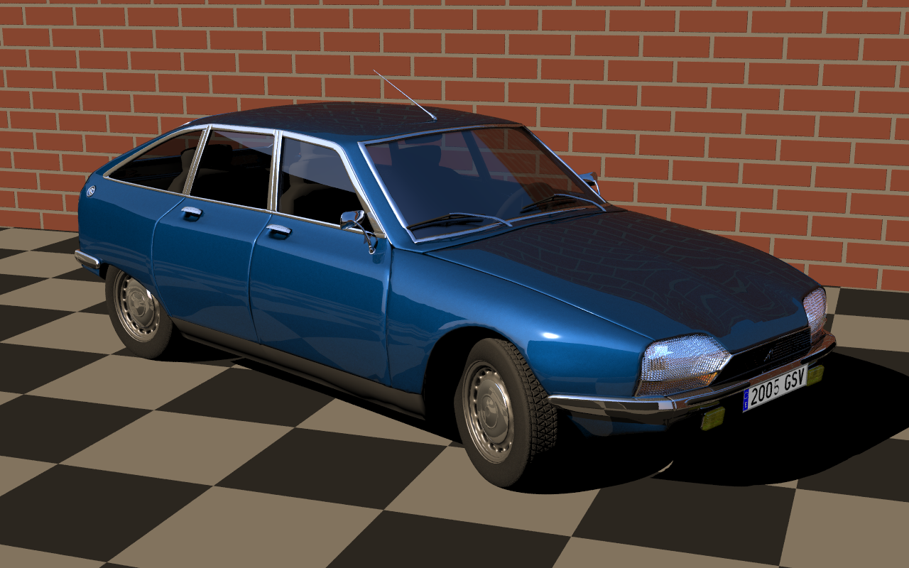

### A Box with Oranges

 

  See http://www.ignorancia.org/en/index.php?page=a-box-of-oranges for more details.

  * fruits woodbox include:
    * fruits_woodbox.inc

  * orange include:
    * isorange.inc

  * grass bank include:
    * grassy_bank.inc

  * grass leaf macro:
    * i_leaf.inc

  * textures:
    * flat_uniformly_aged_metal_6080084.jpg
    * flat_wood_4022164.JPG
    * grassy_bank_7160794.jpg
    * grassy_bank_7160794b.jpg

This creation is licensed under a Creative Commons Attribution-ShareAlike 3.0 Unported License.

http://creativecommons.org/licenses/by-sa/3.0/

### Dice

  * main include:
    * dice.inc  - found on wikipedia.org

License: XXX

### Micra K11

Nissan Micra K11 car model

Author: Rene Bui - http://www.renebui-onlinestudio.com/

  * demo scene:
    * micra_demo.pov

  * main include:
    * i_micra_k11.inc

  * parts includes:
    * i_micra_r_wheel.inc
    * i_micra_rf_wheel.inc
    * i_micra_glass.inc
    * i_micra_accessories.inc
    * i_micra_mat.inc
    * i_micra_plates.inc
    * i_micra_lf_wheel.inc
    * i_micra_inner.inc

  * textures:
    * micra_blinker_l.jpg
    * micra_blinker_r.jpg
    * micra_cover_lf.jpg
    * micra_cover_lr.jpg
    * micra_cover_rf.jpg
    * micra_cover_rr.jpg
    * micra_headlight_l.jpg
    * micra_headlight_r.jpg
    * micra_rearwindow_1.png
    * micra_rearwindow_2.png
    * micra_taillight_l.jpg
    * micra_taillight_r.jpg
    * micra_windshield.png

This creation is licensed under a Creative Commons Attribution-NonCommercial 3.0 Unported License.

http://creativecommons.org/licenses/by-nc/3.0/

### Vintage car inspired on a Citroen GS

 

Author: Jaime Vives Piqueres - http://www.ignorancia.org/

Modelled mainly with Wings3D, following the blueprints of a Citroen GS and
reference photos of many different GS variants. A few parts were done with 
POV-Ray, as the main car assembly include and the demo scene.

  * demo scene:
    * citroen_gs_demo.pov
    * i_rad.inc

  * main include:
    * i_citroen_gs.inc

  * parts includes:
    * i_citroen_gs-antenna.inc
    * i_citroen_gs-back-door.inc
    * i_citroen_gs-bare-chassis.inc
    * i_citroen_gs-bumpers.inc
    * i_citroen_gs-door-handles.inc
    * i_citroen_gs-fender.inc
    * i_citroen_gs-foglight.inc
    * i_citroen_gs-front-door.inc
    * i_citroen_gs-front-grille.inc
    * i_citroen_gs-front-light.inc
    * i_citroen_gs-glass.inc
    * i_citroen_gs-hood.inc
    * i_citroen_gs-interior.inc
    * i_citroen_gs-logo.inc
    * i_citroen_gs-lower.inc
    * i_citroen_gs-mirror.inc
    * i_citroen_gs-rainguide.inc
    * i_citroen_gs-rear-door.inc
    * i_citroen_gs-rear-light.inc
    * i_citroen_gs-rim.inc
    * i_citroen_gs-tyre.inc
    * i_citroen_gs-wchromed.inc
    * i_citroen_gs-wwiper.inc
    * i_citroen_gs-textures.inc

  * generic car paint parts:
    * i_car-seat-front.inc
    * i_car-seat-back.inc

  * generic car paint textures:
    * i_car-textures.inc

  * maps:
    * hf_car-plate.png
    * im_car-plate.png

This creation is licensed under a Creative Commons Attribution-ShareAlike 3.0 Unported License.

http://creativecommons.org/licenses/by-sa/3.0/

